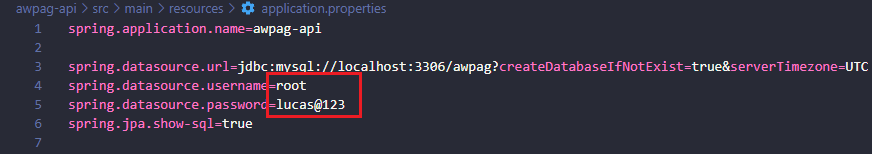
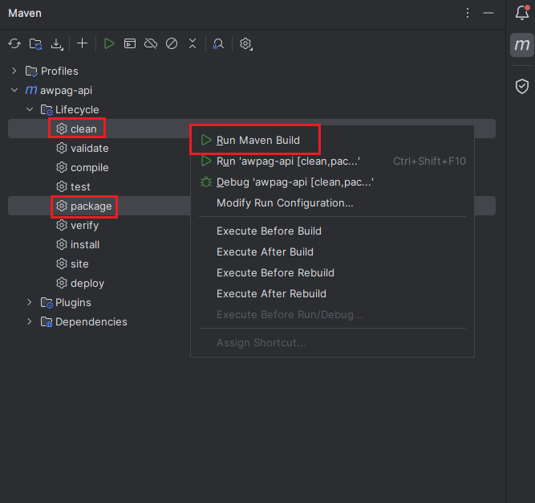

# intensivao-spring-rest

Repositório usado para revisar os conhecimentos em Java e também usado para armazenar a REST API construído durante o intensivo oferecido pela AlgaWorks.

## Funcionalidades Spring REST API de pagamentos

- Cadastro/Exclusão de clientes.
- Gerenciamento de pagamentos.

## Linguagens, Framework e Banco de dados

- Java;
- Spring Framework;
- MySQL

## Ambiente de desenvolvimento

- OpenJDK Runtime Environment Temurin-21.0.2+13 (build 21.0.2+13-LTS)
- IntelliJ IDEA 2023.3.5 (Community Edition)
- GitHub Desktop - Version 3.2.3
- MySQL Server 8.0 Community
- MySQL Workbench 8.0 Community
- Postman Desktop Agent v10.24

## Como iniciar o projeto

Se você deseja dar dicas ou contribuir para o desenvolvimento, siga estas etapas:

Obs: prepare o ambiente de desenvolvimento antes de seguir os passos.

1. Clone o repositório:

```bash
git clone https://github.com/LucasDoGit/intensivao-spring-rest
```

2. configure o MySQL para usar a porta padrão **3306**.

3. Acesse o arquivo `awpag-api/src/main/resources/application.properties` e configure o seu usuário de acesso ao MySQL.
   

4. Abra o diretorio `/awpag-api` usando o IntelliJ IDEA, usando o Maven faça um build dos seguintes conjuntos de ciclo de vida:
   

5. Pronto! É só dar um start no arquivo main localizado em: `awpag-api\src\main\java\com\lucasdogit\awpag\AwpagApiApplication.java`

## Contato

Para obter mais informações, entre em contato conosco em:

- Email: lucas.saiz19@gmail.com
- GitHub: https://github.com/LucasDoGit
